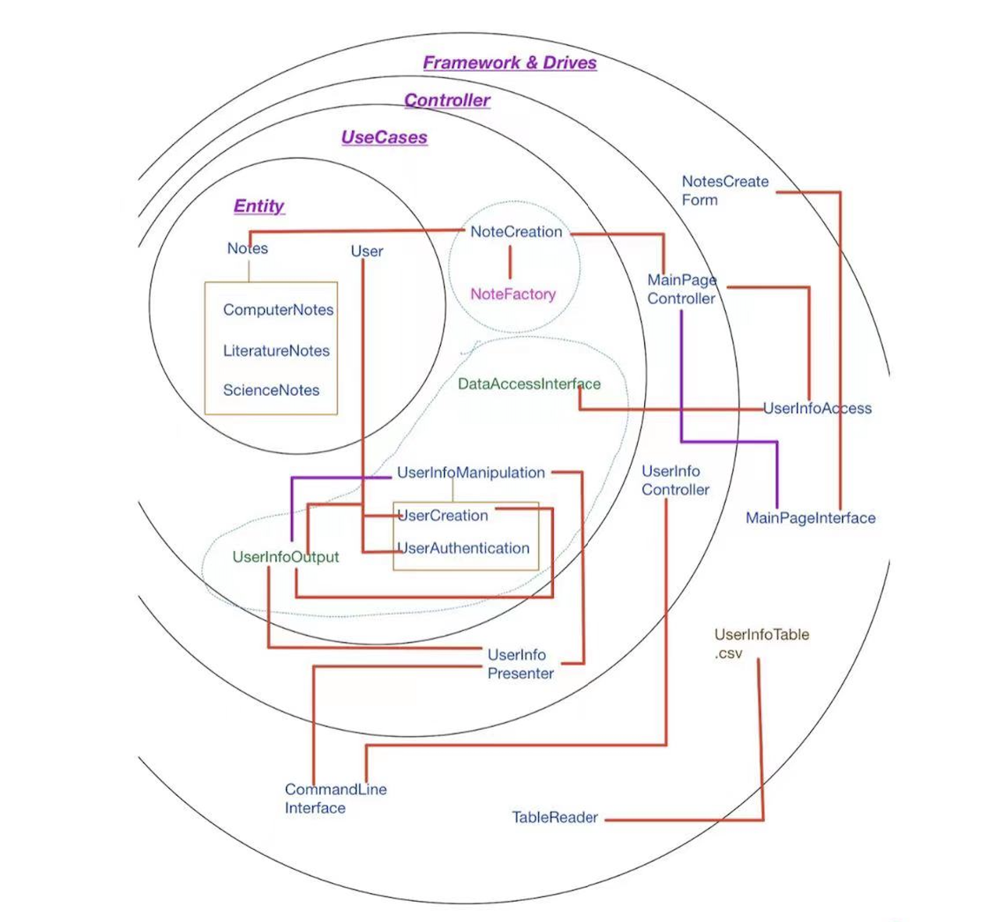

### Specification Summary
This project is an online resource-sharing system. It is designed to create an open-source environment for students to share their notes and understandings about courses and subjects in order to help each other. It allows users to register accounts, log in to their accounts, share their own posts about their notes taken during classes, access the notes and posts shared by other users, and interact with them by Q&A sessions.

***
### SOLID Design Principals

###### 1. Single Responsibility Principal (SRP)

Definition: A class should have one and only one reason to change, meaning that a class should have only one job.

The entity class of Notes remains its function of superclass, any features on top of it should be added as interfaces. Thus, notes only have one job to act under the basic characteristics of notes.

###### 2. Open Closed Principal (OCP)

Definition: Software entities (classes, modules, functions, etc.) should be open for extension, but closed for modification.

Notes is open for extension to include different classes/modules/functions, the superclass of notes is not opened for modification.

###### 3. Liskov Substitution Principal (LCP)

Definition: This means that every subclass or derived class should be substitutable for their base or parent class.

We use many interfaces in our program to obey LCP. 

###### 4. Interface Segregation Principal (ISP)

Definition: A client should never be forced to implement an interface that it doesn’t use, or clients shouldn’t be forced to depend on methods they do not use.

When user browse for notes, they can decide on the level of categories they want to use to locate their desired notes. For example, they can choose to user the interface of level of course, and void using breadth requirement.

###### 5. Dependency Inversion Principal (DIP)

Definition: Entities must depend on abstractions, not on concretions. It states that the high-level module must not depend on the low-level module, but they should depend on abstractions.

Notes cannot depend on lower classes(i.e. controllers etc.). Whenever notes need to connect a lower level class, it must be passed through an interface class(e.g. use cases).

  
***
### Clean Architecture 

- Entities: Notes (notes inherit from an abstract class Notes.java. Each note owns its instance values and methods to fulfill the user's requirements.)
- Use Cases: Rate, Comment, Create, Edit
- Controllers: WelcomePartController and MainPageController. WelcomePartController controls users’ registration and login. It calls corresponding use cases to create a new user object or check if the input information exists. MainPageController controls the creation and edition of the notes by users by calling relevant Use Case classes as CreateNotes and EditNotes.
- UI & DB: UserInfoTable.csv, Android or Software

***
### Design Patterns
- **Template Method Design Pattern**: 
 Template method can help us to override specific steps of the algorithm in subclasses
but not change the structure which inherited from its superclass. To be more specific,
when we use template method, it will separate the algorithm from superclass into steps
by steps, each of steps will allow subclass to override. Be mentioned that the methods
of the superclass do not override. In order to implement every subclass, we need to
declare all separated algorithm steps “abstract”. Therefore, the advantages about the
template method are we can extend individual step in each subclass, while the structure
in the superclass as the same all the time. Based on our project, a note-uploading system, the most important thing is to upload files into the system. However, different readers may prefer different file formats. For example, pdf files, word docx files, .txt files or csv files. All files have similar code for data processing and analysis, the differences are the format and some basic typesetting. By using the template method design pattern, we will not write similar code for three times. What we need to do is to create a main abstract class, which is
implemented by every subclass. 

***
### Use of GitHub Features
- Pull the most up to date files from main repository to individual repo
- Push the files to the main repo and leave meaningful comments
- Issues: We create new issues identifying new features, and then leave the TODOs in some files to give check points for future modification.

***
### Functionality  

The user can register or login to their account by username and password. The user can leave comments and rate the notes. If a user uploaded a note, its name will be shown as the author of the note, and indicate the type of the note, such as pdf, jpeg, typing or handwritten.

The user can either create a new note, modify an existing note, comment on other notes, or rate notes. There are various Categories as courses in the system where users can upload their notes corresponding to each course. Each note is classified by courses. The note is labeled with the date updated, and indicates whether it can be edited by the user. If a note is the original form from the user who uploads it, a tag called “Original” will be labeled as well. If the note is not original, it should have references listing the referenced articles.

***
### Testing
- Most of the Use Case methods are tested, excluding the abstract UserManipulation. Since our Use Case methods involve all the actions required, most of the components are tested. We tested whether a user who is totally new to our system can register successfully, and whether a user who already has an account can login to our system successfully. We tested if a new note can be created, (to be continued…) The UserNotePair is considered unnecessary, so we can simply ignore that test.

***
### Major Design Decisions Made
- Redesigned most of the codes, separating UI and controller.
- Added a new package UseCase.UserInfo, renaming and redesigning all classes related to Controller 1.
- Created a commandline in the form of UI, which can complete all commands of UserAuthenticate and the first part of ProjectMain.
- Added new design pattern Data Access Object, which allows inner object reaches outer codes by implementing DataAccessInterface to Database.
- Two interfaces, UserInfoOutput and DataAccessInterface, were designed to adhere clean architecture and Dependency inversion principle. In this case, inner objects can call interfaces instead of directly depending on outer codes.

***
### Packaging Strategy
We chose to package by layer, as our folders are named: Entity, UseCase, Controller, data, UserInterface, Main and tests.
Since we were struggling with the clean architecture, packaging by layers can help us to have a clearer view on our layers and help us to adhere both the clean architecture and SOLID.
In this case, we could also do a better group work since everyone had a clearer view on the structure of this project.

***
### Progress Report
###### open questions your group is struggling with
- Some codes still need debugging.
- Features are not completed, some features still need to be implemented.

###### what has worked well so far with your design
- We suppose this project adheres the Clean Architecture and SOLID principles.
- Most codes runs without errors.

###### a summary of what each group member has been working on and plans to work on next
- Ruiyu Wang: Worked on the logic and structure of codes, Welcome Page code cleanup, and functionality. Planning to do the cleanup of the next page, and improve UI and Database.
- Shengyue Zhang: Completed all existing testing codes. Planning to add more unit tests when all features are all set.
- Yuxuan Gu: Debugged in MainPageController, and renamed variables. Planning to do the parts which are not taken.
- Yuanyuan Che: Assisted on clean architecture and SOLID principle, added Major Design Decisions Made, Packaging Strategy, and Progress Report to this doc. Planning to continue making efforts on the clean architecture.
- Qianning Lian: Worked on design pattern, made supplement on Use of GitHub Features in this doc.
- Bingxian Chen: Wrote this design document, developed front end features and user experience design.

