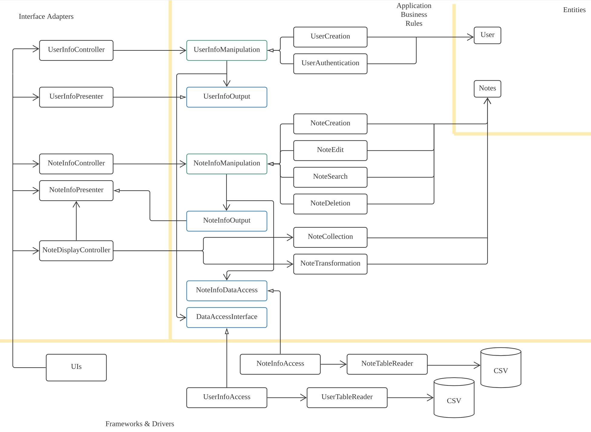

#Phase 2 Project Document

## SOLID Principles

### Single Responsibility Principle:

A class should have one and only one reason to change, meaning that a class should have only one job.

* The system has to interact with the `Notes` entity in various ways. Therefore, we created different Use Case objects to carry each functionality rather than combine them as a whole. Examples are `NoteCreation`, `NoteEdition`, etc. 

* To control the overall complexity of the system, an abstract class `NoteInfoManipulation` is created and all the Note-Controlling Use Case objects (such as `NoteCreation`) are inherited from it. The Controller calls the abstract parent class but uses the functionalities in the subclasses to do different jobs. Each subclass only take one job from the parent class.

* The logic is the same in the user authorization sections. Jobs such as login and register are distributed to separated classes `UserCreation` and `UserAuthentication`.

### Open-Closed Principle:
Software entities (classes, modules, functions, etc.) should be open for extension, but closed for modification. 

* The above-mentioned abstract class `NoteInfoManipulation`, along with `UserInfoManipulation` which controls the `User` Entity are also examples of Open-Closed Principle. All the Entity-controlling objects are their subclasses as they provide a universal constructor pattern for instantiation.

* If there are new functionalities need to be implemented, all we need to do is simply create a new use case object to inherit one of them and add new features based on the requirement. No code modifications are needed.

### Liskov Substitution Principle :
Every subclass or derived class should be substitutable for their base or parent class. The subclass should satisfy all features of its parent class before implementing new features.

* All the subclasses of `UserInfoManipulation` have implemented all the methods in the parent class. Therefore, they can take any of the jobs that the parent class takes without raising any issues. 

* All the subclasses of `NoteInfoManipulation` have implemented all the methods in the parent class. Therefore, they can take any of the jobs that the parent class takes without raising any issues. 

### Interface Segregation Principle:
A client should never be forced to implement an interface that it doesn’t use, or clients shouldn’t be forced to depend on methods they do not use.

* There are two directions of information output in the Use Case layer: one towards controller and one towards database. Although they are in the same section, we created different interfaces to ensure that the interfaces are clean and simple. e.g. `NoteInfoDataAccess` only deals with the output of `Notes` to the database and `UserInfoOutput` only deals with the output of `User` to the controller. They fall into the same layer (Use Case) but they are separated.

### Dependency Inversion Principle：
Entities must depend on abstractions, not on concretions. It states that the high-level module must not depend on the low-level module, but they should depend on abstractions.

* Interfaces are created to block the dependency flow from lower-level modules to higher-level modules. 

* In the Use Case layer, `UserInfoOutput` interface is created and the `UserInfoPresenter` in the controller layer implements it. When, for instance, `UserCreation` is going to make a return to the controller class, it uses the interface to change the presenter object rather than depend on it directly. This prevents `UserCreation` from explicitly knowing the details of  `UserInfoPresenter`, thus prevents dependency inversion. Dependency injection is also used here as the presenter object is sent to the Use Case by the controller.

* The pattern is similar when the the system is accessing data. A `UserInfoAccess` object implement the `DataAccessInterface` in the Use Case layer and is injected to `UserCreation`. The Use Case objects manipulates the interface to make real changes to the database.

## Clean Architecture

The overall structure of the project with Clean Architecture is presented below:

*Classes in blue and green are interfaces and abstract classes, respectively.*

A user is able to register/login to the account, have a look at all the notes uploaded, and then manage own notes. 

When the user enters the username and password in the register/login page, the UI calls the `UserInfoController` to handle the event. The Controller pass the commands to the corresponding Use Case class with a presenter object and a database object by dependency injection. The Use Case class, for example, `UserCreation`, creates the corresponding user entity and stores the information into database by the help of `DataAccessInterface.` By the help of `UserInfoOutput`, the interface that the presenter implements, the Use Case object is able to edit the presenter and return it to the controler with the successfulness of the command it input. UI can access this presenter and present the result back to the user. 

Assume that the user successfully logged-in or registered, then it goes to the main page. UI calls the `NoteDisplayController` which uses `NoteCollection` class to get all the note information in the database. Since they are stored as Strings in the database, they are transformed into Notes entity by `NoteTransformation` before they are returned by the presenter. Two interfaces, `NoteInfoOutput` and `NoteInfoDataAccess`, are used to prevent dependency inversion from Use Case to presenter and database, respectively. After this step, the user is able to browse all the notes in the database by the help of UI.

The User can choose to upload own notes and manage them. The UI layer collects the information of the note from user and pass it to `NoteInfoController`, which distribute the task to the corresponding Use Cases. Similar with other Use Cases and Controllers in this project, the Use Cases objects here creates `Notes` objects, update changes and save changes to the database by the help of `NoteInfoDataAccess` interface and return the presenter as `NoteInfoOutput` interface. `NoteInfoPresenter`, which implements `NoteInfoOutput`, returns a boolean value (represents the successfulness of the operation) and corresponding notes if user need them. UI uses the information presented and displays them to the user.

Dependency Rules are followed strictedly as interfaces are used in every cases that the lower-level modules such as Use Cases are depending on higher-level modules. The presenter object, take `UserInfoPresenter` as an example, is created in the controller and 'injected' to the Use Cases which receive it as a `UserInfoOutput` interface. Use Cases only calls the corresponding methods in the interface but never know how they are implemented outside.

## Design Patterns

### Data Access Object Pattern

Data Access Object Pattern is used to separate low level data accessing operations from the real database.

* `NoteInfoDataAccess` and `DataAccessInterface` are the two interfaces added in the Use Case layer to allow classes to store details to the database without knowing it. 

* `NoteInfoAccess` and `UserInfoAccess` are the two concrete classes implement the interface to complete the functionalities. However, they do not access the databases directly. 

* `NoteTableReader` and `UserTableReader` are the two classes used by `NoteInfoAccess` and `UserInfoAccess`. They access the data in the database and change them as needed. 

Under this pattern we increase the modularity of each objects. If there is a change in databases, only the `NoteTableReader` and `UserTableReader` need to be modified. 

### Facade Pattern

//TODO

## Use of GitHub Features

### Pull requests

Group members created various branches to store their own works for later pull requests to main. Besides those individual contribution, we also used branch and pull requests to create sub-groups and separate tasks.

#### UI, Test and Note branches

During phase 2, we separated the projects into three parts: **UI**, **Test**, and **Note**. Three branches in the same names are created for group members to work on. 

Since implementing UI, Test functions and Note entity has very little overlap, we ensured that all the team members can now work on more specific subjects rather than making changes as a whole, which causes much more conflicts.

UI branch and Test branch are merged into the main branch on Nov 30, 2021 in pull request `UI Merge` and `Test`. Pull request `Merge note` is created to merge the Note branch into main. However, it is closed because 
* it implemented much fewer functionality that expected since some group members were absent due to illness 
* There are conflicts that make the branch unable to merge with main automatically. 

#### Hardfork

As a consequence of the incompletion of **Note** branch, we decided to cut some functionalities of the project. Since it is a big update, we decided not to change it directly in the main branch because there are discussions about which functionalities are going to be cut off. 

Therefore, a new branch **Hardfork** is created for us to choose the functionalities to be kept and implement the rest of codes. This name does come from the blockchain terminology since we were, at that time, working on two parallel branches to see which is better.

**Hardfork**, in the later time, is considered as the better one for the program. Therefore, it is merged into main (basically replaced the original functionalities of notes) in pull request `merge forks` on Dec 4, 2021.

### Issues

We used issues to identify features under completion. For example, we made checkpoints in GUI completion, code documentation and tests completion.

## Testing (Compared to Phase 1)

In Phase 1, we tested most of the use case methods and we’ve tested the update table method for user information.

In Phase 2, all methods for the user have been tested (user login and register, user information table update, check whether the username matches the password) without affecting the source database. We created a new csv file just for testing, and overloaded the methods that directly read or update the csv file. Polymorphism on TableReader constructor (which reads the user information table) so that all testing results will show only in the test file.

Most methods for notes have been tested (e.g. note creation, note edition, note deletion, etc.). We’ve also created a testing csv file, and the source database won’t be affected. Methods that will directly update or read the source database are overloaded for testing purposes. Polymorphism on the NoteTableReader constructor so that all the testing results will show in the testing file and note the source database.

## Refactoring, Code Organization and Documentation

### Refactoring

* As in phase 0, we packaged all the classes under clean architecture layers. `Entities`, `Controllers` and `UseCase` classes are classified into packages with the same name. The outmost layer is separated into two packages `UserInterface` and `Data`. 

** In

## Problems We Face
Template design pattern was not applied as expected. At first, we considered uploading different types of notes such as pdf, word, txt, etc. Due to time constraint and lack of knowledge in knowing how to upload documents such as pdf or pictures to the system, we finally decided not to apply that.
Teammates either dropped the course,  got sick or were in hospital, so it was really hard to have everyone together to talk about the project.

## What To Do Next…
Keep working on extending functions on notes, and the interactions between users. E.g: Like notes
Think about how we can better apply clean architecture in our code to make it more “clean”.
Think about more design patterns that can be applied.

