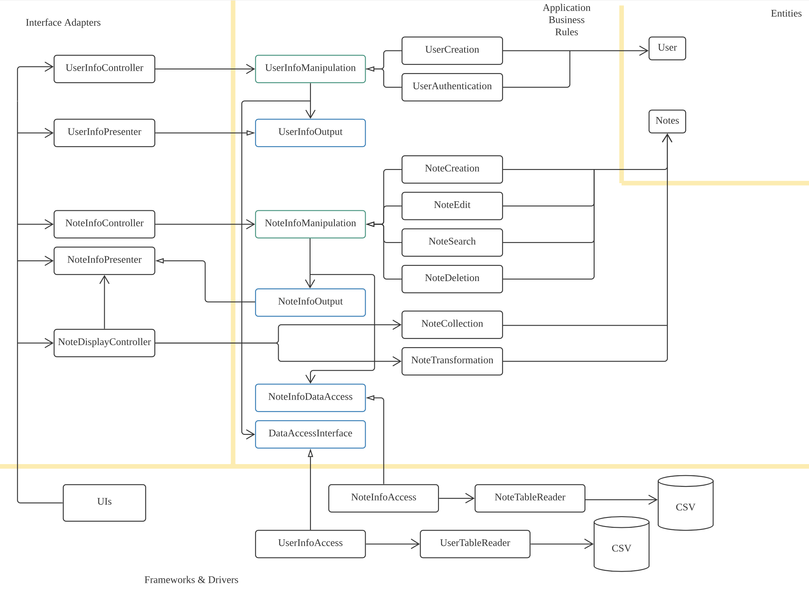

#Phase 2 Project Report

## Project Overview

### Project Purpose

This project is an online resource-sharing system. It is designed to create an open-source environment for students to share their notes and understandings about courses and subjects to help each other. It allows users to register accounts, log in to their accounts, share their posts about their notes taken during classes, access the notes and posts shared by other users.

### Project Funtionality

**A demo video is uploaded along with this document for displaying functionalities.**
https://drive.google.com/file/d/1hLzTcc7brXqvYyNH0g5K-nGHqFNP5bDF/view?usp=sharing 

#### UI

* The user can interact with the system with a user-friendly interface. Instructions are clear and understandable.

#### User Identificaton

* A user can register an account or log in to an existing account by username and password.
* The information of users is stored in a database so the users do not need to register again when the program restarts.
* No more functionalities will be displayed to the user until they successfully log in or register.

#### Note Browsing

* Users can browse and access others' notes in the program.

#### Note Managing

* Users can upload, edit, delete the notes they created. 
* The information of notes is stored in a database so the users do not need to upload notes again when the program restarts.
* Notes are labeled by users so that they cannot change others' notes.

#### Invalid Input Handling

* Users' input will not be accepted if it is incomprehensible. Proper errors will be thrown.

## SOLID Principles

### Single Responsibility Principle:

A class should have one and only one reason to change, meaning that a class should have only one job.

* The system has to interact with the `Notes` entity in various ways. Therefore, we created different Use Case objects to carry each functionality rather than combine them as a whole. Examples are `NoteCreation`, `NoteEdition`, etc. 

* To control the overall complexity of the system, an abstract class `NoteInfoManipulation` is created and all the Note-Controlling Use Case objects (such as `NoteCreation`) are inherited from it. The Controller calls the abstract parent class but uses the functionalities in the subclasses to do different jobs. Each subclass only takes one job from the parent class.

* The logic is the same in the user authorization sections. Jobs such as login and register are distributed to separated classes `UserCreation` and `UserAuthentication`.

### Open-Closed Principle:
Software entities (classes, modules, functions, etc.) should be open for extension but closed for modification. 

* The above-mentioned abstract class `NoteInfoManipulation`, along with `UserInfoManipulation` which controls the `User` Entity are also examples of the Open-Closed Principle. All the Entity-controlling objects are their subclasses as they provide a universal constructor pattern for instantiation.

* If there are new functionalities that need to be implemented, all we need to do is simply create a new use case object to inherit one of them and add new features based on the requirement. No code modifications are needed.

### Liskov Substitution Principle :
Every subclass or derived class should be substitutable for their base or parent class. The subclass should satisfy all features of its parent class before implementing new features.

* All the subclasses of `UserInfoManipulation` have implemented all the methods in the parent class. Therefore, they can take any of the jobs that the parent class takes without raising any issues. 

* All the subclasses of `NoteInfoManipulation` have implemented all the methods in the parent class. Therefore, they can take any of the jobs that the parent class takes without raising any issues. 

### Interface Segregation Principle:
A client should never be forced to implement an interface that it doesn’t use, or clients shouldn’t be forced to depend on methods they do not use.

* There are two directions of information output in the Use Case layer: one towards the controller and one towards the database. Although they are in the same section, we created different interfaces to ensure that the interfaces are clean and simple. e.g. `NoteInfoDataAccess` only deals with the output of `Notes` to the database and `UserInfoOutput` only deals with the output of `User` to the controller. They fall into the same layer (Use Case) but they are separated.

### Dependency Inversion Principle：
Entities must depend on abstractions, not on concretions. It states that the high-level module must not depend on the low-level module, but should depend on abstractions.

* Interfaces are created to block the dependency flow from lower-level modules to higher-level modules. 

* In the Use Case layer, the `UserInfoOutput` interface is created and the `UserInfoPresenter` in the controller layer implements it. When, for instance, `UserCreation` is going to make a return to the controller class, it uses the interface to change the presenter object rather than depend on it directly. This prevents `UserCreation` from explicitly knowing the details of  `UserInfoPresenter`, thus preventing dependency inversion. Dependency injection is also used here as the presenter object is sent to the Use Case by the controller.

* The pattern is similar when the system is accessing data. A `UserInfoAccess` object implements the `DataAccessInterface` in the Use Case layer and is injected to `UserCreation`. The Use Case objects manipulate the interface to make real changes to the database.

## Clean Architecture

The overall structure of the project with Clean Architecture is presented below:

*Classes in blue and green are interfaces and abstract classes, respectively.*

A user can register/login to the account, have a look at all the notes uploaded, and then manage their notes. 

When the user enters the username and password in the register/login page, the UI calls the `UserInfoController` to handle the event. The Controller passes the commands to the corresponding Use Case class with a presenter object and a database object by dependency injection. The Use Case class, for example, `UserCreation`, creates the corresponding user entity and stores the information into the database with the help of `DataAccessInterface.` With the help of `UserInfoOutput`, the interface that the presenter implements, the Use Case object can edit the presenter and return it to the controller with the successfulness of the command it input. UI can access this presenter and present the result back to the user. 

Assume that the user successfully logged in or registered, then it goes to the main page. UI calls the `NoteDisplayController` which uses the `NoteCollection` class to get all the note information in the database. Since they are stored as Strings in the database, they are transformed into Notes entity by `NoteTransformation` before they are returned by the presenter. Two interfaces, `NoteInfoOutput` and `NoteInfoDataAccess`, are used to prevent dependency inversion from Use Case to presenter and database, respectively. After this step, the user can browse all the notes in the database with the help of UI.

The User can choose to upload their notes and manage them. The UI layer collects the information of the note from the user and passes it to `NoteInfoController`, which distributes the task to the corresponding Use Cases. Similar to other Use Cases and Controllers in this project, the Use Cases objects here to create `Notes` objects, update changes, and save changes to the database with the help of the `NoteInfoDataAccess` interface and return the presenter as `NoteInfoOutput` interface. `NoteInfoPresenter`, which implements `NoteInfoOutput`, returns a boolean value (represents the successfulness of the operation) and corresponding notes if the user needs them. UI uses the information presented and displays them to the user.

Dependency Rules are followed strictly as interfaces are used in every case that the lower-level modules such as Use Cases are depending on higher-level modules. The presenter object, take `UserInfoPresenter` as an example, is created in the controller and 'injected' to the Use Cases which receive it as a `UserInfoOutput` interface. Use Cases only calls the corresponding methods in the interface but never know how they are implemented outside.

## Design Patterns

### Data Access Object Pattern

Data Access Object Pattern is used to separate low-level data accessing operations from the real database.

* `NoteInfoDataAccess` and `DataAccessInterface` are the two interfaces added in the Use Case layer to allow classes to store details to the database without knowing it. 

* `NoteInfoAccess` and `UserInfoAccess` are the two concrete classes implement the interface to complete the functionalities. However, they do not access the databases directly. 

* `NoteTableReader` and `UserTableReader` are the two classes used by `NoteInfoAccess` and `UserInfoAccess`. They access the data in the database and change them as needed. 

Under this pattern, we increase the modularity of each object. If there is a change in databases, only the `NoteTableReader` and `UserTableReader` need to be modified. 

### Facade Pattern

The idea of the Facade Pattern is to separate a set of parallel operations into smaller tasks for different classes to implement but still call one object for interaction. In our project, we used a different way to implement this while still taking the advantage of the pattern.

#### Taking Notes Controller and Use cases as example:
* After UI collects necessary information from the user, it sends a 'package' of information to the controller. The information in the package varies but it is wrap up into two parts: operation code and support information.
* Operation code: stored as an integer to represent the operation under execution. For example, code 1 represents `createNote()` operation.
* Support information: stored as an Arraylist to represent any other information needed. To create a note, the system needs the category of the note, a title, a date, the content, and the reference.
* The use case classes that execute operations inherit from `NoteInfoManipulation` abstract class. This enables: 1. further extension; 2. integration of common codes; 3. restriction of classes from having different ways of construction, therefore 4. easy alternation and substitution as the child classes can replace each other without any modification.
* The controller execute the operation by calling the corresponding subclass (in the example, `NoteCreation`) in the form of its parent class. Using the function that `NoteCreation` overrides from the parent class, it is able to use the support information to create a new note, store it and return the information to the presenter.
* **All in all**: Facade Pattern allows the higher level classes to access only one class for multiple functions while not violating the SRP. Our program also do the same thing by using information packages to interact with one class for functionalities in multiple smaller classes. Although it is not 100% following the pattern's implementation, we call it at least a facade-ish pattern as we use the same idea for designing.

## Use of GitHub Features

### Pull requests

Group members created various branches to store their works for later pull requests to main. Branches and pull requests allows individuals to test new codes and features without affecting codes in main branch. Besides those individual contributions, we also used branch and pull requests to create sub-groups and separate tasks. 

#### UI, Test and Note branches

During phase 2, we separated the projects into three parts: **UI**, **Test**, and **Note**. Three branches in the same names are created for group members to work on. 

Since implementing UI, Test functions and Note entity has very little overlap, we ensured that all the team members can now work on more specific subjects rather than making changes as a whole, which causes much more conflicts.

UI branch and Test branch are merged into the main branch on Nov 30, 2021, in pull request `UI Merge` and `Test`. Pull request `Merge note` is created to merge the Note branch into the main. However, it is closed because 
* it implemented much less functionality than expected since some group members were absent due to illness 
* some conflicts make the branch unable to merge with the main automatically. 

#### Hardfork

As a consequence of the incompletion of the **Note** branch, we decided to cut some functionalities of the project. Since it is a big update, we decided not to change it directly in the main branch because there are discussions about which functionalities are going to be cut off. 

Therefore, a new branch **Hardfork** is created for us to choose the functionalities to be kept and implement the rest of the codes. This name does come from the blockchain terminology since we were, at that time, working on two parallel branches to see which is better.

**Hardfork**, in the later time, is considered as the better one for the program. Therefore, it is merged into main (basically replaced the original functionalities of notes) in pull request `merge forks` on Dec 4, 2021.

### Issues

We used issues to identify features under completion. For example, we made checkpoints in GUI completion, code documentation, and tests completion. Issues correspond with TODO comments in the codes. An Issue is closed as long as all the related TODOs are implemented.

## Testing Updates

In Phase 1, we tested most of the use case methods and we’ve tested the update table method for user information.

In Phase 2, all methods for the user have been tested (user login and register, user information table update, check whether the username matches the password) without affecting the source database. We created a new CSV file just for testing and overloaded the methods that directly read or update the CSV file. Polymorphism on TableReader constructor (which reads the user information table) so that all testing results will show only in the test file.

Most methods for notes have been tested (e.g. note creation, note edition, note deletion, etc.). We’ve also created a testing CSV file, and the source database won’t be affected. Methods that will directly update or read the source database are overloaded for testing purposes. Polymorphism on the NoteTableReader constructor so that all the testing results will show in the testing file and note the source database.

## Refactoring, Code Organization, and Documentation

### Refactoring

* All the file and method names are changed clearly. File names include their main functionalities and entity name (e.g. UserCreation). Class names use *UpperCamelCase* and method names use *lowerCamelCase*. This is finished in commit #7f3e09b.

* Code smells, such as the long parameter list, are eliminated. 

### Code Organization

* As in phase 0, we packaged all the classes under clean architecture layers. `Entities`, `Controllers`, and `UseCase` classes are classified into packages with the same name. The outmost layer is separated into two packages `UserInterface` and `Data`. 

* In `Data`, `Entity`, and `UseCase` packages, classes are even separated by the entity they are related to. For example, `UseCase` package is separated into sub-packages `UserInfo` and `NoteInfo`.

* `UserInterface` package is separated into `GUI` and `CommandlineUI` to store graphic UI and command-line UI separately.

* The main entrance of the project, `ProjectMain` is saved in an individual package, `Main`.

### Documentation 

* *Javadoc* is used in every class.

* Classes are designed to be as simple and understandable as possible for others to review. 

* Warnings are fixed in recent issues.

## Problems We Faced

### Technical issues

#### Databases

We used a CSV file to store the information in the phase 0 demo. In the next phases, we were planning to use MySQL instead as it is more professional and provides more functionalities for data access. However, using MySQL requires the implementation of local databases on every team member's computer which caused more issues than expected. Therefore, we switched back to CSV reader in the final stage. It is dumb but much easier to use.

#### User Interface

We decided to develop an android java app at the beginning of this project. However, none of us are experienced in developing apps. Some group members are facing struggles when using java swing. Currently, we developed a GUI and also a complete and runnable command-line interface as the backup plan.

### Soft issues

Compared with technical issues, the soft issues are the ones that do not involve any knowledge restrictions but still slow down the development progress.

#### Meeting Organization

Group members lived far away from each other in our project. Also, we had different time arrangements. Therefore, in the early stage, we are not able to find a proper time to hold in-person meetings. We overcome this problem by scheduling online meetings instead, but meeting others in person could be a better way to build up the atmosphere as a team.

#### Unexpected Events

In phase 0 we have 8 active members in the group. By the end of phase 1, one of the team members dropped the course. During the most time of phase 2, 2 of our team members were sick and no longer active. Unexpected events increased our average workload and forced us to decide to slim down the program since some of us were overloaded.

## What To Do Next…

### In the scope of CSC207:

* Consider more design patterns that fit the project.
* Add more functionalities, such as commenting on others' notes.
* Debug, handle invalid inputs.

### Out of CSC207 scope:

* Optimize the database.
* Using nodejs or other tools to build a real online server.
* Improve the UI. Switch it into a web app or Android app for wider applications.

## A Summary of What Each Group Member Has Been Working During the Phrase 2

* Ruiyu Wang: Manage everything. Mainly focused on access and retrieving information from databases.
* Chengyue Zhang: Mainly focused on testing, design pattern and documentation. Implemented features for notes.
* Yuxuan Gu: Debugged MainPageController, implemented features for notes and code documentation.
* Qianning Lian: Create the User Interface for users to interact. Created UI to interact with the user.
* Ke Gong: Implemented features for notes, reorganize Entity, code documentation.
* Yuanyuan Che & Bingxian Chen: Sick in phase 2.
